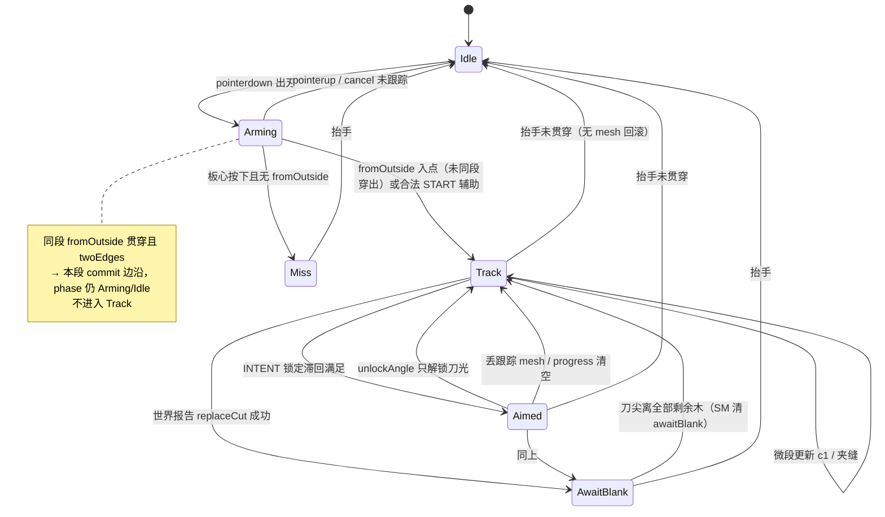

# 划切意图识别重构

参数真源：`src/game/design.ts`（`START` / `INTENT` / `FLASH` / `TRAIL`）。手感只改那里（或调试面板同一份对象）。  
玩法总规范：[SLASH-DESIGN.md](./SLASH-DESIGN.md)。连续切输入：[SLASH-TECH.md](./SLASH-TECH.md)。  
本文是**意图识别（入点、锁定、行程、提前刀光、快划补出边、中止）**的重构设计。震动不在范围内。

| 项 | 值 |
|----|-----|
| 作者 | — |
| 日期 | 2026-09-16 |
| 状态 | Draft |
| 语言 | 中文（标识符保持英文） |

---

## Overview

Islash Cut 是竖屏 WebGPU 练习原型：滑动=刀，板=木头。**真切开**仍要求进出落在两条不同凸包边上（或快划辅助把出点补到预测出边）。反馈层（夹缝、刀光、划痕）与提交解耦。当前「出边才切」手感偏晚，入点辅助、锁定滞回、85% 提前刀光、快划补切散落在 `cutTarget.ts`、`slashIntent.ts`、`slashWorld.ts`、`slashDebug.ts`，同一条政策被四处实现，难以推理。

本重构把意图收成**单一状态机模块**，几何命中仍走 `slashHit.ts`，网格切开仍走 `slashCut.ts`，绘制仍走 overlay。禁止推测性 `replaceCut` + 回滚。`design.ts` 仍是唯一参数表。

---

## Background & Motivation

### 现状

一刀生命周期被拆成：

| 文件 | 实际拥有的政策 |
|------|----------------|
| `cutTarget.resolveCutBySegment` | `awaitBlank` 清除、入点辅助（`START`）、同段贯穿立刻切、板内快划 85% 补出边、`twoEdges` 提交（提交时先删 `progress`） |
| `cutTarget.previewCutChord` | 入点→刀尖无限线裁包 = 青线全弦 |
| `cutTarget.crackAlongStroke` | 夹缝几何；切完 `slicedIds` 后仍可跟手（忽略 awaitBlank） |
| `cutTarget.twoEdges` | 文件私有：进出边不同才算切 |
| `slashIntent.updateSlashIntent` | 刀光锁定/解锁滞回（**只灭刀光锁，不丢 progress**） |
| `slashWorld` 闭包 | `earlyFlashed` / `flashHot` / `aimStable`、commit 补闪、`freezeFlash` |
| `slashDebug` overlay | 夹缝底层、刀光中层（`FLASH.life`）、划痕顶层、INTENT.debug 三色弦 |
| `design.ts` | `START` `INTENT` `FLASH` `TRAIL` |

`slashWorld.onMove` 顺序：先 `tryCutSeg`（提交），再夹缝，未切则 preview + intent + 提前刀光。`FLASH.minTravelRatio`（0.85）被两处共用，但**门闩不同**：快划补切只要几何行程；提前刀光还要 INTENT 锁 + aim + `FLASH.minSpeed`。

`FLASH.minSpeedOff` **从未被读取**。`flashHot` 一旦为真，直到解锁 / 切开 / 新划才清，没有按 `minSpeedOff` 熄。`design.ts` 注释写提前刀光「每划只出一次」，代码在成功切开后把 `earlyFlashed` 置回 `false`，实际是**每刀一次**。

### 痛点

1. **Commit-on-exit 体感晚**：政策已用快划 85% 补切与提前刀光缓解，但读代码看不出「提交 vs 反馈」边界。
2. **政策碎片**：改 `aimAngle` 或入点规则要同时摸三个文件，容易漏「切完重置 `earlyFlashed`」这类会话级状态。
3. **会话状态藏在闭包**：`earlyFlashed` 不在 `SlashStroke` 上，同一划第二刀能否再闪依赖 `slashWorld` 局部变量。
4. **入点只看按下点**的产品规则写在 `design.ts` 注释，实现夹在 `resolveCutBySegment` 的 `!fromOutside` 分支里，难测。

---

## Goals & Non-Goals

### Goals

- 单一模块/状态机覆盖：enter、lock、travel、early-flash **边沿**、fast commit、跟踪丢失、抬手结束。
- `slashWorld` 只编排：输入段 → 状态机 step → 若 `frame.commit` 则 `cutMeshBySlash`；overlay **只消费帧上的 flash 标志**，不重算政策。
- 参数仍只在 `design.ts`（调试面板继续绑同一对象）。
- 保持下文「已定产品规则」手感不变（先抽状态机，再折入 START / FLASH；PR2 冻结 commit 像素与 flash 次数）。
- 文档化当前 vs 目标文件布局；增量 PR。仓库暂无测试 runner（无 vitest/jest），手感 PR 用 INTENT.debug 清单，测试另开。

### Non-Goals

- 关卡 / 分数 / 连击 / 其它手势。
- 震动、音效。
- 推测网格切开再 rollback。
- 改倒角/挤出/冲量（`slashCut` / `wood*` / `bladeForce`）。
- 机器学习分类器、Fruit Ninja 碰触即切。
- 生产 metrics / 网络。
- 本重构不「修好」切开失败后 progress 已消耗的既有 quirk（见下文冻结项）。

---

## 已定产品规则（本会话最终版）

### 1. 提交 vs 反馈

- **真 mesh 切**：进出两条不同凸包边，或快划辅助用预测出边完成。
- **反馈**（夹缝、刀光）独立。禁止 `replaceCut` 试切再回滚。

### 2. 青线

`clipInfiniteLineToHull(lockedEnter, currentTip)` = **预测贯穿全弦**，不是「已经划过的距离」。

### 3. 夹缝（深色）

- 起点 = 凸包入点 A，终点 = 手指夹在包内。
- 入端宽（随长度 `crackGrow`，上限 `crackWMax`），指尖细（`crackW`）。
- 图层：底。必须从入边起笔，不能从板心长出来。
- 本划已切（`slicedIds`）时，画夹缝**忽略** `awaitBlank`（`crackAlongStroke` 在 `progress` 已空时仍可对剩余木回投）。

### 4. 刀光

- 中层。纺锤（两头细、中间肥）。从入边长出，起点略在入边外（`overshootBack`）。
- 短时最宽（`coreW`），拉满最细（`coreWMin`），再淡出。总寿命 `FLASH.life` = 0.3s（**overlay 时钟**，不是状态机相位）。
- 方向胶在夹缝（同角）。视觉跨度沿夹缝方向：`spanMin` + 出端 overshoot，不只是 enter→tip 长度。
- 屏上最多 1 条刀光。
- **提前刀光每刀最多一次**；已提前放过则 commit 不再闪；未放过则 commit **必须**闪。
- 慢划：无提前刀光。提前刀光还要：INTENT 已锁 + 对准（`aimAngle`/`aimSegs`）+ `speed >= FLASH.minSpeed` + 沿青线几何行程 ≥ 85%。
- 快划板内补切：只要几何行程 ≥ 85% 且 `twoEdges`，**不要** aim / INTENT lock / `FLASH.minSpeed`。
- 同一划 **mesh 切开成功** 后重置 `earlyFlashed`，下一刀可再闪。
- `FLASH.minSpeedOff` 保留在参数表但不参与本重构逻辑（现码未读）。

### 5. 划痕

顶层手指折线带。`getPredictedEvents` 存在但 `TRAIL.predictAlpha = 0`，预测点不当刀光。当前 `TRAIL.show = 1`。

### 6. 入点辅助（A）

- **只看 pointer-down 位置**（`stroke.points[0]`），拖近边缘不算。
- 按下在板**心**（最近边距 &gt; 档位 `maxDist`）：**永不**辅助，拖出也不捏造贯穿切。宁可 miss。
- 慢（&lt; `START.fastSpeed` 160）：按下距边 ≤ `slowDist` 10 **且** 相对第二近边 unique（`slowClear` 8px）→ 吸最近边。
- 快：按下距 ≤ `fastDist` 36；`clipBackToEnter`；若回投边 ≠ 按下最近边（含打到对边），**仍用最近边点** `near.point`，不用回投点。
- 转角：两条近边都在 `maxDist` 内且 `second.dist - near.dist < START.slowClear` → 等 `chordLength(press, b) ≥ START.cornerMove`（`b` = 本段刀尖），再 `clipBackToEnter`。接受条件与现码一致：`ranked.find(r => r.edge === backEdge)` 且该行 `dist ≤ maxDist`——**任意**排到的边只要在 `maxDist` 内，不限于两条最近边。
- 开始跟踪仍须 `fromOutside` **或** 合法辅助。真从外侧 clip 不变。
- **同一微段从外贯穿**：`fromOutside && clipped && !insideB && twoEdges` → **本段直接 commit**，不写 `progress`、不进 Track。
- A 一旦写入 `progress.c0`，不漂移。

### 7. 出点辅助

- 慢：不帮，必须真的从另一边出去。
- 快：沿青线 **几何** `travelRatio ≥ FLASH.minTravelRatio`（0.85）**且** `twoEdges(enter, predictedExit)` → commit，`c0`=锁定 A，`c1`=预测包出点。
- 与提前刀光 **共用行程阈值参数**，但提前刀光另加锁/瞄准/滑速；**未对准不得把 travelRatio 置 0**，否则会挡掉快划补切。

### 8. 刀光锁定 / 瞄准

`INTENT` 锁定滞回只驱动刀光预览。`ang > INTENT.unlockAngle` → `locked=false`、清稳定计数，**跟踪与 `progress.c0` 仍在**，仍可 twoEdges / 快划 85% 提交。方向不够准 → 无提前刀光，**不是**切失败。

### 9. 调试叠加（`INTENT.debug`）

青 = 预测全弦，粉 = 锁定弦，黄 = 实际 commit。

---

## Proposed Design

### 原则

```
几何（slashHit + twoEdges）     政策（新状态机）      切开（slashCut）
     │                                │                    │
     └────────────── slashWorld 编排 ──────────────────────┘
                              │
                         overlay 只画
```

- 状态机**输出意图事件**，不持有 mesh、不调 Rapier。
- 纯几何：`clipInfiniteLineToHull`、`clipBackToEnter`、`rankedHullEdges` 仍在 `slashHit.ts`。`twoEdges` 现为 `cutTarget.ts` 文件私有；目标迁到与 `CutTarget` 同模块或 `slashHit.ts` 导出，**不要假装它已经在 slashHit**。
- `awaitBlank`：世界在 **mesh 切开成功** 后置 `true`；状态机在每段开头若 `awaitBlank && !tipInAnyHull` 则清 `false`（照抄 `resolveCutBySegment` 65–67）。夹缝绘制豁免见上。

### 目标状态机

Early flash / commit / abort **不是相位**。刀光播完不改变 phase；overlay 用 `FLASH.life` 自己淡出。INTENT 解锁只把 `locked` 打回 false，phase 留在 `track`。



同一 `SlashStroke` 可 Track →（commit 边沿）→ AwaitBlank → Track 多刀。**意图 commit 边沿即删 `progress`**（见冻结 quirk）。世界 `replaceCut` **成功** 后：`awaitBlank=true`、reset lock、`earlyFlashed=false`。失败则不置 awaitBlank，且 **不恢复 progress**。

边沿（同帧最多一种 flash）：

- `earlyFlash`：Aimed + 提前刀光门闩 + `!earlyFlashed` → 置 `earlyFlashed=true`，本帧不 commitFlash。
- `commit`：真出边 / 同段贯穿 / 快划 85%（无 aim 要求）。
- `commitFlash`：本刀 `commit && !earlyFlashed`（SM 在置 commit 时读快照；若本刀早已 early 过则为 false）。
- 同一刀不会 `earlyFlash` 与 `commitFlash` 同时为 true。

### 每微段数据流

```mermaid
sequenceDiagram
  participant Input as slashInput
  participant World as slashWorld
  participant SM as slashIntent
  participant Hit as slashHit
  participant Cut as slashCut
  participant Overlay as slashDebug

  Input->>World: onMove(stroke, seg, dt)
  World->>SM: step(meshes, camera, stroke, seg, dt)
  SM->>Hit: rankedHullEdges / clip*
  SM->>SM: twoEdges / travelRatio(cyan, tip)
  Note over SM: 先算 crack（progress 仍在）再删 progress
  SM-->>World: IntentFrame（commit 帧 crack 仍应非空，若入点已知）
  World->>Overlay: setCrack(frame.crack)
  alt frame.commit
    Note over SM: 意图 commit 后 progress 已空
    World->>Cut: cutMeshBySlash(c0,c1)
    alt mesh 成功
      World->>World: replaceCut; slicedIds.add; awaitBlank=true
      World->>World: 再查 crack（slicedIds 路径）
      World->>Overlay: setCrack(updated or frame.crack)
      World->>Overlay: freezeFlash()
      opt frame.commitFlash
        World->>Overlay: flash(c0,c1, preview=false)
      end
    else mesh 失败
      World->>World: 不置 awaitBlank；不恢复 progress
      Note over Overlay: 本段不 flash；保留本帧已 setCrack
    end
  else 无 commit
    opt frame.earlyFlash
      World->>Overlay: flash(crack ?? cyan, preview=true)
    end
  end
  World->>Overlay: setIntentDebug
```

世界 **禁止** 再用 `!stroke.intent.earlyFlashed` 自行推导补闪。只信 `frame.earlyFlash` / `frame.commitFlash`。

### `IntentFrame`（PR2 合同）

```ts
export type IntentPhase =
  | 'idle'
  | 'arming'
  | 'miss'
  | 'track'
  | 'aimed'
  | 'awaitBlank';

export type IntentFrame = {
  phase: IntentPhase;
  /** 锁定入点 A；未跟踪则为 null */
  enter: DesignPoint | null;
  /** 无 enter 时为 -1 */
  enterEdge: number;
  meshId: number | null;
  /** 青线全弦；无预测则为 null */
  cyan: { c0: DesignPoint; c1: DesignPoint } | null;
  /**
   * 夹缝。SM 必须在删除 progress **之前**用当时的 A/tip 算好写入本帧
   * （否则 commit 帧 progress 已空、slicedIds 尚未 add，crack 会空一帧）。
   * slicedIds 非空时即使 awaitBlank 也可非空。
   */
  crack: { c0: DesignPoint; c1: DesignPoint } | null;
  locked: boolean;
  /**
   * 刀尖沿 cyan 的投影长度 / |cyan|。始终几何计算；
   * 无 cyan 时为 0。对准与否不得改写此值。
   */
  travelRatio: number;
  /** 本段滑速 px/s（与 segmentSpeedPxPerSec 相同） */
  speed: number;
  /** 本段应触发提前刀光（边沿，每刀一次） */
  earlyFlash: boolean;
  /** 意图提交（progress 已消耗）；mesh 尚未切 */
  commit: CutTarget | null;
  /**
   * commit 且本刀尚未 early 过。世界：freezeFlash 后
   * 若为 true 则 flash(..., false)。
   */
  commitFlash: boolean;
};
```

不设 `phase: 'earlyFlash' | 'commit' | 'abort'`。不设笼统 `abort: boolean`（抬手结束由 `onEnd`；丢 mesh 表现为 `phase='track'` 且 `meshId=null`）。

`headingAngleDeg` 已在 `slashIntent.ts` 导出，`slashWorld` 只是 import；折入后世界不再调用它算 aim。

会话字段：

| 字段 | 现位置 | 目标 |
|------|--------|------|
| `progress` / `c0` / `enterEdge` | `SlashStroke.progress` | 保留，由状态机写 |
| `awaitBlank` / `slicedIds` | `SlashStroke` | 保留；SM 清 awaitBlank，世界成功切开后置 true |
| `intent.locked/stable/c0/c1` | `slashIntent` | 并入状态机 |
| `earlyFlashed` `flashHot` `aimStable` | `slashWorld` 闭包 | `stroke.intent`。`flashHot` 语义保留（闩到解锁/切开/新划），**仍不读** `minSpeedOff` |

### 入点（抽自 `resolveCutBySegment` 126–198 行）

行为与现码一致：

```
press = stroke.points[0]
if fromOutside:
  clipped = clipChordToHull(a, b)
  if clipped && !insideB && twoEdges(enter, exit):
    emit commit { c0, c1 }   // 同段贯穿，不写 progress
    return
  锁 c0；phase=track；return
ranked = rankedHullEdges(press, hull)  // 不是 tip
near, second = ranked[0], ranked[1]
fast = speed >= START.fastSpeed
maxDist = fast ? START.fastDist : START.slowDist
if !near || near.dist > maxDist: miss
corner = second && second.dist <= maxDist && (second.dist - near.dist) < START.slowClear
if corner:
  if chordLength(press, b) < START.cornerMove: wait（本段不入 track）
  hit = clipBackToEnter(a, b, hull)
  row = ranked.find(r => r.edge === closestHullEdge(hit.c0))
  if !row || row.dist > maxDist: miss this segment
  c0 = hit.c0; enterEdge = row.edge
else if fast:
  hit = clipBackToEnter(...)
  if hit && closestHullEdge(hit.c0) === near.edge:
    c0 = hit.c0
  else:
    c0 = near.point  // 含回投对边
else:
  c0 = near.point
锁 progress.c0，禁止后续改 A
```

### 出点 / 提交（抽自 65–123 行）

```
if awaitBlank:
  if !tipInAnyHull: awaitBlank = false
  else: 不提交（crack 仍可画）
if still inside:
  if speed < START.fastSpeed: no commit
  cyan = clipInfiniteLineToHull(c0, tip)
  travelRatio = proj(tip - c0 onto cyan) / |cyan|   // 纯几何
  if twoEdges(enter, cyan.exit) && travelRatio >= FLASH.minTravelRatio:
    commit { c0, c1: cyan.exit }   // 此处删除 progress
else:
  if twoEdges(enter, exit): commit 实测 c0→c1；删除 progress
```

慢划无板内补切。`travelRatio` 在未锁定/未对准时 **照样算**。

### 提前刀光（抽自 `slashWorld` 187–228）

与 85% 补切分离。全部满足才 `earlyFlash` 边沿：

1. `INTENT` 已锁定。
2. 连续 `FLASH.aimSegs` 段方向 vs 青线（`headingAngleDeg`）≤ `FLASH.aimAngle`。
3. `speed >= FLASH.minSpeed`（180）。不使用 `minSpeedOff`。
4. **几何** `travelRatio >= FLASH.minTravelRatio`。
5. `!earlyFlashed`。

提前触发弦：`crack ?? locked`（现码）。寿命与纺锤只在 overlay。

Commit 路径（世界，顺序冻结）：

1. `cutMeshBySlash`；失败则 HUD「碰到了但切开失败」，**不** freeze/flash，**不** awaitBlank。
2. 成功：`replaceCut` → `awaitBlank=true` → `overlay.freezeFlash()` → 若 `frame.commitFlash` 则 `overlay.flash(commit, false)`。
3. 成功后 `earlyFlashed = false`（下一刀）。

### Overlay 职责收缩

`slashDebug.ts` **不再解释政策**，只执行 `setCrack` / `flash` / `freezeFlash` / `push` / `setIntentDebug`。刀光网格与 `FLASH.life` 留 overlay。

`previewCutChord` / `crackAlongStroke` 并入 `slashIntent.ts`（或 slashHit 旁纯函数）。`CutTarget` 类型与 `twoEdges` 最终住在 `slashIntent.ts`（或 slashHit）；**PR5 才删除 `cutTarget.ts`**，PR3 不得删。

---

## API / Interface Changes

### Before

```
slashWorld.onMove
  resolveCutBySegment(...)      // START + 同段贯穿 + 85% + awaitBlank 清除
  crackAlongStroke(...)
  previewCutChord(...)
  updateSlashIntent(...)        // 仅 lock
  // 本地 aimStable / flashHot / earlyFlashed
  // tryCutSeg: freezeFlash; if (!earlyFlashed) flash(..., false)
```

### After

```
slashWorld.onMove
  const frame = stepSlashIntent(...)  // 内部：crack → 再删 progress
  overlay.setCrack(frame.crack)       // commit 帧也画，禁止只在 else 里 setCrack
  if (frame.commit) {
    const ok = tryReplaceCut(frame.commit)  // 成功才 slicedIds + awaitBlank
    if (ok) {
      // 同段贯穿从未写 progress：用 slicedIds 路径补夹缝，对齐现 onMove
      const crack = crackAlongStroke(...) ?? frame.crack
      overlay.setCrack(crack)
      overlay.freezeFlash()
      if (frame.commitFlash) overlay.flash(frame.commit.c0, frame.commit.c1, false)
    }
  } else if (frame.earlyFlash) {
    overlay.flash(frame.crack ?? frame.cyan, true)
  }
  overlay.setIntentDebug(...)
```

同一段 `commit` 与 `earlyFlash` 互斥。**每帧都 `setCrack`**（含 commit），避免切帧夹缝闪没。`createSlashInput` 回调不变。`SlashIntent` 扩字段，`emptyIntent()` 同步。调试面板不加新滑条。

---

## Data Model Changes

无持久化。运行时：

- `SlashStroke.intent` = 意图会话真源（含 `earlyFlashed`）。
- **意图 commit**：SM **先**用当前 `progress.c0`（或同段贯穿的 clip 入点）写入 `frame.crack`，**再**删 `progress`、reset lock（与现 `resolveCutBySegment` return 前 `progress.delete` 一致）。不得先删再算 crack，否则本帧 `frame.crack` 为空，而世界此时还没 `slicedIds.add`。
- **mesh 成功**：世界置 `awaitBlank=true`、`slicedIds.add`、`earlyFlashed=false`；再查一次夹缝（`slicedIds` 豁免路径）并 `setCrack`，覆盖「同段贯穿从未写 progress」的切帧。
- **mesh 失败**：不置 awaitBlank、不恢复 progress（用户须重新进入）。**冻结此 quirk，禁止「成功才删 progress」。**
- **awaitBlank 清除**：SM `step` 顶部 `if (awaitBlank && !tipInAnyHull) awaitBlank=false`。

无迁移。

---

## 当前散落 vs 目标布局

| 逻辑 | 现在 | 目标 |
|------|------|------|
| `START` 入点辅助 | `cutTarget.resolveCutBySegment` | `stepSlashIntent` enter（PR3） |
| 同段 fromOutside 贯穿 | 同上 196–198 | enter 同段 `commit`（PR3/PR4） |
| `twoEdges` | `cutTarget.ts` 私有 | 随 `CutTarget` 迁出；可 `slashHit` 导出（PR5） |
| 快划 85% 补出边 | `cutTarget` 板内，无 aim | 同一 commit；`travelRatio` 纯几何（PR4） |
| `awaitBlank` 置 true | `slashWorld` 成功 replaceCut | **仍世界** |
| `awaitBlank` 清 false | `resolveCutBySegment` 65–67 | **状态机 step** |
| 青线 preview | `previewCutChord` | 状态机 `cyan`（PR5 搬家） |
| 夹缝 | `crackAlongStroke` | 状态机 `crack`（PR5） |
| INTENT 锁 | `slashIntent.ts` | 并入；解锁 ≠ 丢跟踪 |
| 提前刀光 / 每刀一次 | `slashWorld` 闭包 | `stroke.intent` + `frame.earlyFlash` |
| commit 补闪 / freeze | `tryCutSeg` | `frame.commitFlash`；世界只执行顺序 |
| 刀光网格/寿命 | `slashDebug.ts` | 仍 overlay |
| `FLASH.minSpeedOff` | design.ts 死参数 | 保留键；逻辑不读（非手感 PR 可改注释「每刀」） |
| 划痕 / predictAlpha | overlay + `TRAIL` | 不变 |
| 参数 | `design.ts` | 不变 |
| 几何 clip | `slashHit.ts` | 不变 |
| 真切网格 | `slashCut` / `replaceCut` | 不变 |

建议文件：保留并升级 `slashIntent.ts`。`cutTarget.ts` **仅 PR5** 删除或改 re-export。

---

## Key Decisions

1. **提交与反馈分家，永不试切回滚**  
   切开是不可逆 mesh/Rapier 替换。意图只预测弦与闪光。

2. **单一状态机，overlay / cutTarget 不拥有政策**  
   不接受「cutTarget 永远当几何层、政策继续躺在里面」：几何已在 `slashHit`，cutTarget 混了 START/提交，正是碎片来源。门面（PR2）只是过渡。

3. **青线 = 无限线裁包全弦**  
   `travelRatio` = 投影/全长，始终几何；aim 不得清零。

4. **入点只看 `stroke.points[0]`**  
   转角接受条件抄 `ranked` 行距，不改成「只许两条近边」。

5. **慢划不作出点辅助、不提前刀光**  
   快划 85% 补切 **不** 要求 aim。

6. **共用 `FLASH.minTravelRatio`，谓词分叉**  
   一个参数，两个门闩：补切 = 几何行程 + twoEdges；提前闪 = 行程 + lock + aim + minSpeed。

7. **`earlyFlashed` 属一刀而非整划**  
   mesh 成功后清零。`design.ts`「每划一次」注释陈旧，改注释不改手感。

8. **参数表不搬家**  
   零手感 diff 的闸门是 PR2：commit 像素与 flash 次数。仓库无测试 runner 时用 INTENT.debug 清单，不假装有单测。

9. **几何仍纯函数**  
   clip 留 `slashHit`；`twoEdges` 显式迁移，不谎称已在 slashHit。

10. **增量 PR，先门面冻结再折政策**  
    EarlyFlash 不是相位。INTENT unlock 不是 Abort。

11. **意图 commit 即消耗 progress**  
    与现码一致；切开失败须重新进板。禁止「成功才删 progress」。

12. **awaitBlank 双写手**  
    置位：世界（mesh 成功）。清除：SM（刀尖离开全部剩余木）。

---

## Alternatives Considered

### A. 保持散落逻辑（现状）

- 优点：无重构风险。  
- 缺点：政策已跨 4 文件。  
- **拒绝**。

### A2. 永远保留薄 `cutTarget` 当几何/提交，状态机只管刀光

- 优点：少搬提交路径。  
- 缺点：85% 行程仍双份；入点辅助仍难测；本次目标就是提交+反馈同一政策核。  
- **拒绝**（PR2 门面可以暂时委托 cutTarget，PR4–5 必须折完）。

### B. ML / 启发式分类器

- **拒绝**：不可调、与凸包边规则冲突。

### C. Fruit Ninja 碰触即切

- **拒绝**：板是贯穿切缝；同边蹭会假切。见 SLASH-TECH。

### D. 推测 `replaceCut` + 失败回滚

- **拒绝**：Rapier/mesh id 不可逆；AGENTS 禁止。

---

## Security & Privacy Considerations

无网络、无账号。仅本地 Pointer Events → 设计坐标。无 PII。折线长度受 `SLASH.interpGap` 插值与 coalesced 采样约束，**没有**硬编码点数上限；本重构不加上限。

---

## Observability

非生产指标。调试：

- `INTENT.debug`：青/粉/黄弦。
- `#status` HUD。
- 调试面板滑条。
- `INTENT.debug===1` 时可把 `frame.phase` 映到 HUD（idle/arming/miss/track/aimed/awaitBlank）。默认不展示。

回滚手段就是对照三色弦 + 手感清单，不是 metrics。

---

## Rollout Plan

- **无 feature flag**。`design.ts` 默认数字不在本重构改（注释「每划→每刀」、标明 `minSpeedOff` 未使用可另开非手感 PR）。
- PR1–5：**无自动测试**（`package.json` 无 vitest/jest）。每 PR 手工清单见下。黄金闸门是 **PR2**。
- 回滚：还原该 PR。

手工清单（每 PR）：

- 慢划真穿出才切；板心按下拖出不切。
- 快划贴边 85% 切（即使刀向微晃、未锁刀光）。
- 提前刀光一次；commit 未提前则 freeze 后必闪；已提前则 commit 只 freeze。
- 同划第二刀可再闪。
- 夹缝从入边起；切后 awaitBlank 期间夹缝仍可跟手。
- 同段快弹贯穿仍切。
- 转角：回投边只要 ranked 距 ≤ maxDist 即接受。
- INTENT.debug 三色。
- 切开失败：HUD 失败文案；须出板再进才跟踪。

### 风险

| 严重度 | 风险 | 缓解 |
|--------|------|------|
| 高 | 入点辅助回归（转角 ranked 行 / 对边回投） | PR3 对照现分支；禁止「只许两条近边」 |
| 高 | travelRatio 与 aim 绑死挡住快划切 | 合同写明几何 travel；PR4 清单含「未瞄准仍 85% 切」 |
| 中 | EarlyFlash 做成相位导致锁/切时机漂 | 相位枚举不含 flash；overlay 管寿命 |
| 中 | unlock 当成 Abort 丢刀 | 解锁只改 `locked` |
| 中 | 双闪 / 漏闪 | 只信 `earlyFlash`/`commitFlash`；freeze 后至多一闪 |
| 中 | awaitBlank 只置不清 | SM 清；第二刀清单 |
| 低 | commit 帧 crack 空一帧 | SM 先算 crack 再删 progress；世界每帧 setCrack；成功后再查 slicedIds |
| 低 | 有人「修好」失败切恢复 progress | PR4 冻结 quirk |

---

## Open Questions

1. `slashIntent.ts` 扩成状态机 vs 新文件？**倾向扩现文件。**  
2. `cutTarget.ts` 删除时机：**PR5**（PR3 只搬入点，PR4 搬提交，文件仍在直到 PR5）。  
3. `FLASH.minSpeedOff`：本重构 **继续不读**，键留在 `design.ts` 以免调试面板/默认对象形状变化。若要删除键，另开非手感 PR。  
4. 单测：**仓库无 runner。** 不在 PR1–5 加 vitest。可选 PR0/PR6 先加最小 vitest，再补 hull 夹具；与手感折入解耦。

---

## References

- [docs/SLASH-DESIGN.md](./SLASH-DESIGN.md) — 玩法与几何  
- [docs/SLASH-TECH.md](./SLASH-TECH.md) — 连续切、Fruit Ninja 对照、段检测  
- `Agents.md` — 入口地图（PR5 应挂上本文）  
- `src/game/design.ts` — `START` `INTENT` `FLASH` `TRAIL`  
- `src/game/cutTarget.ts` — `resolveCutBySegment` `previewCutChord` `crackAlongStroke` `twoEdges`  
- `src/game/slashIntent.ts` — `updateSlashIntent` `headingAngleDeg`  
- `src/game/slashWorld.ts` — `tryCutSeg` / 提前刀光闭包  
- `src/game/slashDebug.ts` — 夹缝 / 刀光 / 划痕  
- `src/game/slashHit.ts` — `clipInfiniteLineToHull` `clipBackToEnter` `rankedHullEdges`  
- `src/game/slashInput.ts` — `SlashStroke` `MeshSlashProgress` `SlashIntent`

---

## PR Plan

增量、每 PR 可单独 review / merge。数字手感默认不改。PR1–5 **不**引入 vitest。PR2 是行为冻结闸门。

### PR1 — 抽出意图会话状态，行为不变

- **标题**：`intent: hoist early-flash session onto SlashStroke`  
- **影响文件**：`src/game/slashInput.ts`、`src/game/slashIntent.ts`、`src/game/slashWorld.ts`  
- **依赖**：无  
- **说明**：把 `earlyFlashed` / `flashHot` / `aimStable` 迁到 `SlashIntent`；`emptyIntent()` 初始化；首点与 **mesh 成功** 路径按现规则清零。lock 公式不变。overlay 调用顺序不变（仍 freeze 再按 `!earlyFlashed` 补闪，本 PR 不引入 `commitFlash`）。**不加测试文件。** 手工跑清单。

### PR2 — 状态机外壳：每段 `IntentFrame`，政策仍委托旧函数

- **标题**：`intent: add stepSlashIntent facade returning IntentFrame`  
- **影响文件**：`src/game/slashIntent.ts`、`src/game/slashWorld.ts`  
- **依赖**：PR1  
- **说明**：`stepSlashIntent` 内部仍调 `resolveCutBySegment`、`previewCutChord`、`crackAlongStroke`、`updateSlashIntent` 与现提前刀光谓词。填齐上文 `IntentFrame`（含几何 `travelRatio`、`commitFlash`、`enterEdge=-1`）。**夹缝：先 `crackAlongStroke`（progress 仍在）写入 `frame.crack`，再让 resolve 删 progress。** `onMove` **每帧** `setCrack`（含 commit alt）；mesh 成功后再查一次 slicedIds 夹缝。世界不得重算 early/commit 闪。黄金：同一手势 commit 点、flash 次数、切帧夹缝不断。HUD 可显示 `phase`。不删 `cutTarget.ts`。

### PR3 — 入点 START 折入状态机

- **标题**：`intent: fold START enter-assist into slash intent machine`  
- **影响文件**：`src/game/slashIntent.ts`、`src/game/cutTarget.ts`  
- **依赖**：PR2  
- **说明**：搬 `!fromOutside` 辅助、`fromOutside` 锁 A、**同段贯穿立刻 commit**。转角用 `ranked.find` + `row.dist > maxDist`，禁止收窄成两条近边。`resolveCutBySegment` 仍负责已跟踪的出边/85%（PR4 再搬）。**不删除 cutTarget。** 手工：板心 miss、慢吸边、快对边改近边、转角、同段贯穿。

### PR4 — 提交与 85% 快划补切折入状态机

- **标题**：`intent: fold twoEdges commit and fast 85% exit assist into machine`  
- **影响文件**：`src/game/slashIntent.ts`、`src/game/cutTarget.ts`、`src/game/slashWorld.ts`  
- **依赖**：PR3  
- **说明**：板内几何 85% + twoEdges、真穿出、awaitBlank 清除进 SM。世界仅在 **mesh 成功** 后 `awaitBlank=true`。清单：**未瞄准的快划 85% 仍切**；INTENT 解锁后晃一刀仍能出边切。  
  **冻结**：`frame.commit` 出现即 progress 已空；`cutMeshBySlash` 失败不恢复跟踪、不置 awaitBlank。禁止改成成功才删 progress。不删除 cutTarget（可瘦身为 re-export）。

### PR5 — FLASH 政策只留状态机；删除 cutTarget；文档入口

- **标题**：`intent: own early-flash policy; remove cutTarget; docs`  
- **影响文件**：`src/game/slashIntent.ts`、`src/game/slashWorld.ts`、`src/game/cutTarget.ts`（删除或纯 re-export 一 PR 内去掉引用）、`src/game/slashHit.ts`（若导出 `twoEdges`）、`src/game/index.ts`（若有导出）、`docs/SLASH-DESIGN.md` 模块表、`Agents.md` 入口地图（加 `docs/SLASH-INTENT.md`）、本文  
- **依赖**：PR4  
- **说明**：提前刀光谓词只在状态机。世界：`freezeFlash` + `commitFlash` / `earlyFlash`。世界不再用 `headingAngleDeg` 算 aim（函数仍留 slashIntent）。`previewCutChord`/`crackAlongStroke` 搬家。模块表：意图机负责何时落刀/刀光政策；cutTarget 行删除。

### PR6（可选，与手感解耦）— vitest + hull 夹具

- **标题**：`test: add vitest and slash intent hull fixtures`  
- **影响文件**：`package.json`、`vitest.config.*`、新建 `src/game/*.test.ts`  
- **依赖**：无（可 PR0 先加 runner；夹具最好在 PR5 后，否则打到旧 API）  
- **说明**：仓库当前 **没有** 测试脚本。本 PR 才加最小 vitest。夹具：矩形 hull 点列覆盖 miss、慢贯穿、快 85% 无 aim、提前闪一次、同划第二刀、同段贯穿、失败切不回 progress。无 WebGPU。  
  **不要**把 vitest 塞进 PR1–5。
